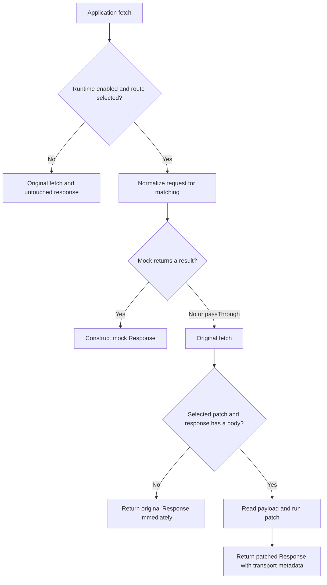

# Next Test Mode: architecture and guarantees

## Purpose

`@uiwwsw/next-test-mode` lets a running application reproduce API-driven UI states by overriding responses at an explicitly connected data boundary. Browser console commands replace or patch browser fetch responses; reusable definitions and stories capture shared scenarios. A visible overlay indicates active test mode on relevant pages. The Next.js adapter uses Draft Mode to preview CSR, SSR, ISR and SSG from the same Console commands.

A scenario is a configuration, not an automated test. The library does not make assertions, decide pass/fail, run a browser, host an API, seed a database, or reset application caches. Browser setup can connect an application refetch callback. SSR synchronization defaults to an automatic page reload after changes. Test assertions remain external.

## Temporary response values

The console exposes `mock`, `patch`, `overrides`, and `reset` for immediate experiments, in memory by default. Core owns these through `setMock`, `setPatch`, `overrides`, and `resetOverrides`. The override registry is separate from the shared feature/story catalog and persistence. It matches the exact normalized pathname and one HTTP method (GET by default), with no API-prefix aliases or patterns. The most recent value for a path/method replaces its predecessor.

An override takes precedence over selected definitions for that request. A patch override bypasses a selected mock so that it can operate on the actual HTTP response; a mock override bypasses selected patches. Removing an override reveals the underlying selected scenario. `clear()` removes both. Explicit cookie-scoped requests ignore in-memory overrides to keep server adapters request-scoped.

Override values are validated JSON snapshots, copied at input, inspection, and resolution boundaries. Patches shallow-merge object fields and reject non-object upstream payloads. Changes notify subscribers; setup can refresh the app or automatically reload SSR pages. The application owns cache invalidation outside fetch. The Next client coordinates Draft Mode before automatically reloading the page.

## Request lifecycle

The original request arguments are retained for transport. `mapRequest` only changes the runtime's view of the request. Unmatched streams are not cloned or buffered. A selected patch buffers its response to expose a complete payload; do not select patches for infinite SSE streams. Explicit binary content types yield an ArrayBuffer; JSON/text payloads are parsed as JSON when possible, otherwise passed as text. URL, status, redirect/type metadata and application headers survive a patch, including cloning. Byte length, encoding and digest/ETag headers are discarded because their original values no longer describe the payload.

Mock and patch features are alternative behaviors for a matching path/method/case. Ambiguous duplicates are rejected. For overlapping patterns with different keys, active keys are visited in sorted order and the first matching definition wins; avoid overlapping patterns when order would matter. Custom match functions should be pure because the adapter can check a match before reading the body and again before executing a handler.

## Modules

| Area | Responsibility |
| --- | --- |
| `src/core.ts` | Definitions, validation, route/case matching, active state, counters, stories, server integration |
| `src/browser.ts` | Console API, extensions, page-aware overlay, subscriptions, installation and cleanup |
| `src/fetch.ts` | Request/Response adaptation, transport preservation, cancellation, fetch installation |
| `src/server.ts` | Incoming-cookie selection and optional JSON handoff, fresh runtime and fetch per request |
| `src/setup.ts` | One-call browser setup, JSON cookie synchronization, debounced refresh and cleanup |
| `src/node.ts` | AsyncLocalStorage request wrapper and framework request-context fetch installation |
| `src/next.ts` | Next Node instrumentation and Draft Mode control route |
| `src/client.ts` | Serialized Draft handshake, Console setup and refresh |
| `src/internal/next-request.ts` | Guarded, read-only Next Draft-provider cookie bridge |
| `src/internal/draft-handler.ts` | Same-origin controls, optional authorization and preview ownership |
| `src/internal/ssr-state.ts` | Versioned, validated and size-bounded JSON cookie snapshots |
| `bin/test-mode.mjs` | Next.js instrumentation scaffolding without modifying existing files |
| `templates/test-mode` | App-owned example definitions, environment configuration and bootstrap |
| `tests` | Runtime and release regression tests using Node's test runner |
| `tests/browser` | Chromium integration of the published ESM build and actual SSR HTML |
| `tests/next` | Installed tarball + CLI in a real Next.js app, unchanged fetch and cache isolation |
| `scripts/check-package.mjs` | Tarball contents, independent install, public exports and consumer type validation |
| `.github/workflows` | Repeatable verification and guarded npm publication |

The runtime has no external dependencies and no import-time DOM or fetch mutation. The root ESM entry remains compatible; `./core`, `./fetch`, `./browser`, `./setup`, `./server`, `./node`, `./next` and `./client` provide independent entry points. Node built-ins and the optional Next peer are only imported through the Node/Next entries. Shared contracts live in `src/types.ts`, with persistence, path normalization and lifecycle helpers in `src/internal/`. Importing core or server does not load browser rendering or console implementations. Sources are shipped with source maps and declaration maps for debugging.

## State and environment

Activation defaults to `NODE_ENV=development` or `NODE_ENV=test`. Browsers without `process` must explicitly supply an `enabled` condition. Storage entries cannot enable a disabled runtime. An app can supply a function if availability needs to be evaluated at request time.

The browser prefers localStorage and uses cookies for handoff/fallback. Each runtime also maintains an in-memory fallback for denied persistence or quota failure. Browser subscribers receive one notification per local change; instances sharing the configured event name can refresh from storage. Use distinct storage, cookie and event names for independent runtimes on one origin. Defaults are `test-mode.entries`, `test-mode:change`, and console namespace `__testMode`.

Without a browser, an instance owns its active state in memory. For shared SSR/server instances, always pass the incoming cookie header (including the empty string when absent) to `resolve`/`applyPatch`. Request counters belong to the runtime instance and entry, so use separate instances if per-request or per-session sequencing is required. This library does not interpret a test-mode cookie as an authentication credential.

## Server rendering boundary

`createServerTestMode({ cookieHeader, ...options })` creates a new runtime per incoming request. It captures registered feature selection from that request's cookie (null means no selection) and returns a fetch bound to the instance state. It never installs a global hook, forwards an incoming Cookie header, or stores data across requests. The wrapper uses `cookieHeader: false` so outgoing authentication cookies cannot reselect a scenario or suppress an override authored by server code. Existing fetch options retain their string/null/undefined behavior.

The factory rejects calls in a browser before any state mutation. Call it inside the server request handler/loader, not at module scope; do not cache its mutable result across requests. Definitions may be shared, but state captured by user handlers is outside the runtime's isolation guarantees.

`setupTestMode({ ssr: true })` synchronously validates and writes a versioned JSON cookie before committing local state. A detached candidate snapshot keeps failed writes and oversized payloads from partially changing the active runtime. The cookie carries entries and JSON overrides, is bounded to 3,500 encoded ASCII bytes, and restores values after reload. SSR sync is opt-in; default browser overrides remain in memory. The manual server factory also requires `ssr: true`; automatic server installers accept synchronization by default. Cookies are browser-session scoped, shared by tabs, and cannot enable a disabled server runtime. Malformed snapshots are ignored as a whole.

`withTestMode(handler)` installs a dispatcher once and uses AsyncLocalStorage for each incoming Node request. Unchanged global fetch calls use that request's runtime; outside the scope they use the original transport. Response completion deactivates the scope. Active test responses receive private/no-store headers. Cleanup supports nested installs and preserves newer third-party hooks.

`installServerTestMode({ getRequest })` supports frameworks with their own current-request accessor. A WeakMap keyed by request identity keeps selections and counters local. A fetch accessor follows later framework replacements, while function proxies preserve framework marker properties. AsyncLocalStorage bypasses recursive interception. `setupNextTestMode()` checks public `draftMode()` without opting ordinary requests into dynamic rendering. Active Draft sessions use a guarded read-only bridge into the internal provider cookie jar for request identity and test cookies, including inside cache scopes. This version-sensitive boundary is tested against Next 16.3.5; unsupported provider shapes throw. Startup and generateStaticParams fetches pass through. Override responses sit outside Next's fetch cache: mocked values never enter it, and patches only transform the returned response. Request-context errors that signal dynamic rendering are rethrown; unscoped startup fetches pass through.

The new browser setup disables app-owned html/body dataset markers by default to avoid mutating React hydration attributes. The visible overlay still works. Low-level overlay defaults stay compatible; callers may explicitly set `datasetName` or false. Both setup and adapters are explicit installations with cleanup, not import-time hooks.

Draft Mode bypasses normal Next page/data caches for a browser session. SSR, SSG, ISR, force-static, generated routes, unstable_cache and Cache Components/use cache are exercised in real production fixtures; the ordinary prerender manifest and anonymous cached output stay intact. Pure static export, Pages Router, Edge, direct DB calls and external caches are outside the automatic adapter. CI verifies raw HTML, second-browser isolation, clear-to-cache behavior, hydration, and a production build with the tool disabled. See [server integration](./server-rendering.md).

## Contracts

- GET/HEAD use query parameters as `body`/`request`; DELETE and other body-capable methods expose their body. Query params are not route-param extraction.
- `RequestInit.headers` replaces Request headers. Reading a Request body for mocking does not consume the original input used by the network adapter.
- `resolve()` returns an HTTP result envelope or null for no match/pass-through. Handler exceptions reject; they are not silently converted to network requests.
- `applyPatch()` returns `{ data }`, including `{ data: null }`, or null for no match. `patch()` is the older payload-only API with an ambiguous null sentinel.
- A mock response can be JSON, text or a native BodyInit value. `bodyFormat: "json"` explicitly JSON-encodes strings as well; temporary mocks use this format. HEAD/204/205/304 remain bodyless. Opaque responses and bodyless upstream responses bypass patching.
- Abort signals reject waiting callers promptly, including while an asynchronous mock is pending. Arbitrary user handler side effects cannot be forcibly cancelled.
- Selecting a case removes all selected cases that conflict on path and HTTP method. Story registration rejects conflicting cases and missing/duplicate metadata or unknown entries. Failed registration does not partially mutate the existing catalog.
- Selecting a story replaces active feature entries; adding a story preserves compatible entries. Story removal removes its referenced entries even if another story also references them.
- `pages` controls discovery and overlay visibility, not whether an API is intercepted. A feature without pages is global; a story must have explicit or inherited pages.
- Fetch cleanup restores the exact previous function and tolerates nested installs removed in either order. It does not overwrite a newer third-party hook.
- Overlay cleanup removes the DOM, dataset markers, subscriptions and scheduled navigation refresh. Nested overlay/console installations preserve owned globals, dataset markers and history methods when removed in either order. Setup failures unwind previously acquired resources, and all cleanup runs even if an extension teardown throws.

## Compatibility changes before the first registry release

The source-only scaffold used Dominos-specific storage/event names and assumed an absent NODE_ENV meant development. The first registry release uses neutral names and explicit development/test activation. Existing scaffold adopters can supply the old keys explicitly to retain saved scenarios. A global browser runtime must now set `enabled` deliberately.

## Release contract

A release must have an existing `v<package.version>` tag, matching lockfile versions, and a commit included in `origin/main`. Runtime, packaging, browser and actual Next.js checks must all pass before the publish job can run. Stable versions use npm's latest channel; prereleases use next. A GitHub release's prerelease flag must agree with the version. Publish credentials are only exposed to publication and the old-package migration notice step; checkout credentials are not persisted. npm publication is immutable, so changes after a release need a new version.

References: [Fetch standard](https://fetch.spec.whatwg.org/), [npm publishing](https://docs.npmjs.com/cli/v11/commands/npm-publish/), [npm trusted publishing](https://docs.npmjs.com/trusted-publishers/).

## Draft lifecycle and control isolation

The client writes the bounded JSON snapshot first, then sends an authenticated-by-origin POST through the original fetch captured before installation. Requests serialize and reconcile the latest snapshot; acknowledged snapshots suppress duplicate refresh timers. Startup reconciles an expired deployment Draft cookie or an owned session with no remaining overrides. Failures reject `ready`/`sync`, report an error and do not reload; the prior local cookie write may already have succeeded.

The control route validates environment, method, Origin/Host, custom header, fetch metadata, JSON and a 1,024-byte body bound. Optional application authorization runs in an AsyncLocalStorage bypass context, so test mocks cannot forge its fetch response. The same bypass covers Draft bookkeeping. An HttpOnly ownership marker allows clear to close sessions opened by this tool while preserving a previously active CMS preview. The application remains responsible for protecting its preview environment and server-rendered routes.

Next Draft Mode controls caching; overrides remain outside Next's fetch cache. The private bridge only reads the two configured test cookies, never forwards the incoming authentication header, and never mutates Next internals. Upgrades must pass production integration checks; a matching peer range alone does not certify future Next releases.

## 0.7: test-code boundary and preview coordinator

The CLI now generates an app-owned `test-mode/catalog`, `client` and `server` folder. Application pages/API calls do not import it. Framework hooks are thin, environment-gated entry points. The client uses a conditional synchronous require so interception is installed before the first application fetch. Production integration checks build enabled/disabled variants and inspect both browser and server JavaScript for a unique catalog marker.

`src/internal/preview-session.ts` owns synchronization independently from the DOM and Next APIs. It tracks the rendered snapshot separately from the requested snapshot and forced-refresh revision. Each connection acknowledges a snapshot; edits arriving during connection or asynchronous refresh are drained before completion. A failed connection or refresh remains observable and retryable, while stop prevents subsequent refreshes.

`src/internal/draft-transport.ts` owns the captured unmockable transport, request validation, timeout (10 seconds by default), parent cancellation and listener/timer cleanup. `src/client.ts` composes it with the generic runtime, Console and a cookie-backed cache-bypass extension. The extension participates in generic `test.clear()` and overlay lifecycle. No cache policy is added to the core response runtime.

`test.cache.status()` distinguishes unknown server state from acknowledged Draft state and exposes pending changes and errors. `bypass()` enables a manual Draft session without data overrides; `refresh()` requests another render even for unchanged values; `restore()` clears overrides, selected scenarios and extensions. These operations preserve existing CMS Draft sessions and never purge shared production caches. See [the cache scope matrix](./concept.md).

Generic Console setup accepts additional `commands` namespaces and `commandHelp`; names colliding with built-in commands are rejected before globals are installed. Next reserves the `cache` namespace. Custom global Console names and disposal continue to work.
